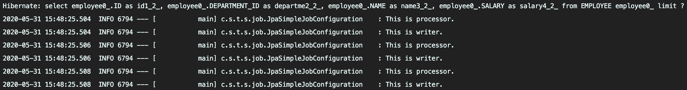
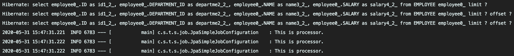

## Chunk Size
> processor, writer에서 한 번에 처리할 수 있는 데이터의 크기  

## Page Size
> JpaPagingItemReader에서 한 번에 조회하는 데이터의 크기  

## 예제코드
**jpaPagingItemReader**를 통해 로드한 데이터를 chunk size와 page size에 따라 processor와 writer에서 어떻게 처리하는지 확인해보겠습니다.
>테스트에서 입력된 record는 총 3개입니다.
```java
private Step jpaSimpleStep() {
    return stepBuilderFactory.get("jpaSimpleStep")
            .<Employee, Employee>chunk(CHUNK_SIZE)
            .reader(jpaPagingReader())
            .processor(processor())
            .writer(printWriter())
            .build();
}
```
```java
private JpaPagingItemReader<? extends Employee> jpaPagingReader() {
    return new JpaPagingItemReaderBuilder<Employee>()
            .name("employeeReader")
            .entityManagerFactory(entityManagerFactory)
            .pageSize(PAGE_SIZE)
            .queryString("select e from Employee e")
            .build();
}
```
```java
private ItemProcessor<Employee, Employee> processor() {
    return employee -> {
        log.info("This is processor.");
        return employee;
    };
}
```
```java
private ItemWriter<Employee> printWriter() {
    return employees -> log.info("This is writer.");
}
```
### chunk size = 1, page size = 3
조회는 1회 발생했지만 chunk size가 1이기 때문에, processor에서 writer가 번갈아 실행된 것을 볼 수 있습니다.  

### chunk size = 3, page size = 1
조회는 3회 발생했지만 chunk size가 3이기 때문에, chunk size만큼 데이터가 모인 후에 전달되어 writer는 1회만 실행된 것을 볼 수 있습니다. 

## 결론
_chunk size와 page size가 다른 경우에는 위와 같이 비효율적인 결과를 보이기 때문에, 보통은 두 값을 동일하게 설정하는 것이 좋습니다._